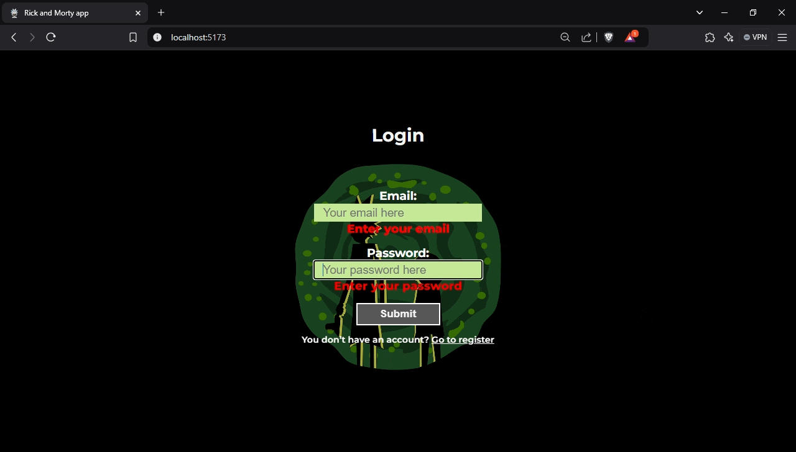
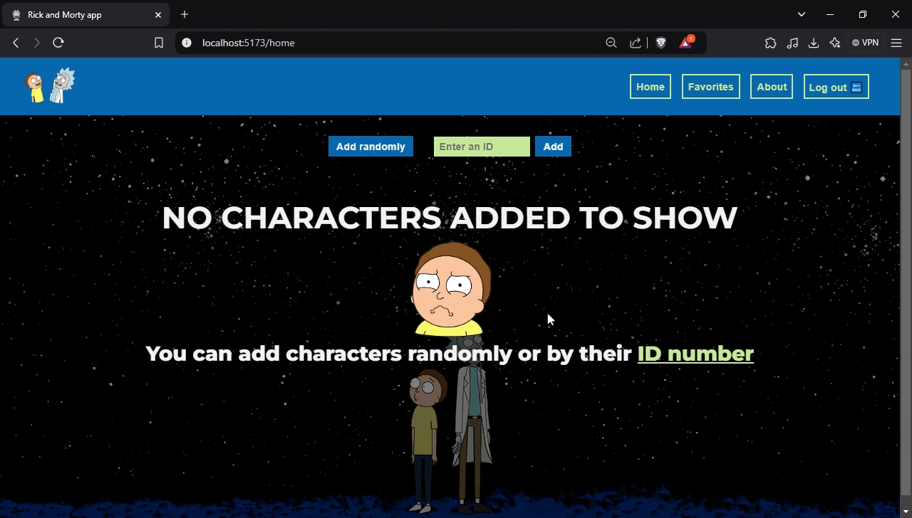

# Rick and Morty app 👾

## By: Joao Bone 👨🏽‍💻

## TECHNOLOGIES USED

- [React](https://react.dev/)
- Javascript
- CSS
- CSS modules
- [Styled Components](https://styled-components.com/)
- [Nodejs](https://nodejs.org/en)
- [Express](https://expressjs.com/)
- [Mongodb](https://www.mongodb.com/)
- [Mongoose ODM](https://mongoosejs.com/)

## CAPTURES OF THE APP 👇

### Login and Register

### Exploring Home section

### Warnings for certain errors

### Exploring Details section

### Responsive design

### Filters and Sorts of Favorite section

### Not found page

