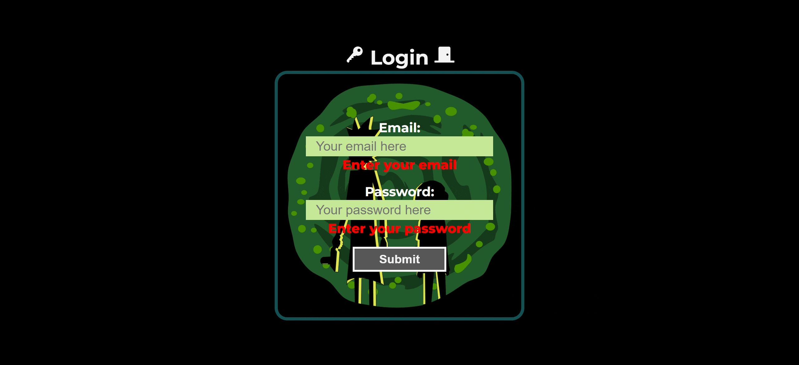

# Rick and Morty app 👾

## By: Joao Bone 🗿

## HOW TO PASS THE LOGIN 🛑

### 1) Enter credentials

**Email: example@gmail.com**

**Password: 123456**

### 2) Altering the App.jsx file

_**From this**_:

```js
useEffect(() => {
	!access && navigate("/")
	/* 	!access && navigate("/home") */

	if (path !== "/" && path !== "/home" && path !== "about") {
		navigate("/notFound")
	}
}, [access])
```

_**To this**_:

```js
useEffect(() => {
	/*  !access && navigate("/") */
	!access && navigate("/home")

	if (path !== "/" && path !== "/home" && path !== "about") {
		navigate("/notFound")
	}
}, [access])
```

---

## CAPTURES OF THE APP 👇

### Login 🚪


### Login success & Login denied (NEW LOGIN) ✅



### Home: adding cards by ID and Ramdonly 🃏


### Responsive Navigation Bar 🚀


### Favorites: Filter and Sort filter 🌟


### Not found page ❌


